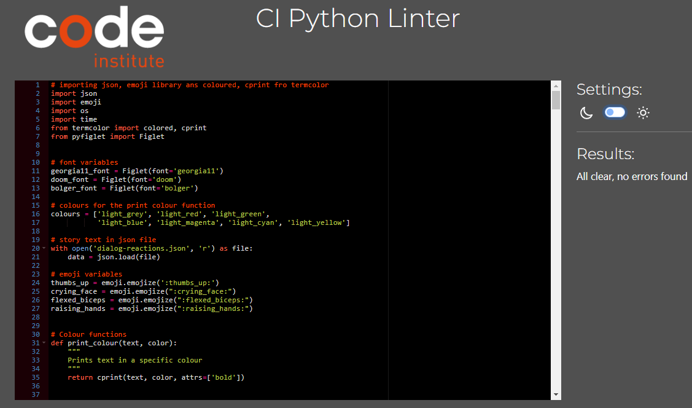
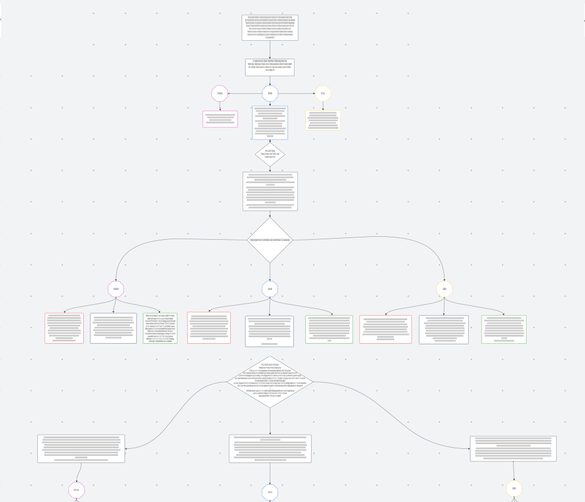
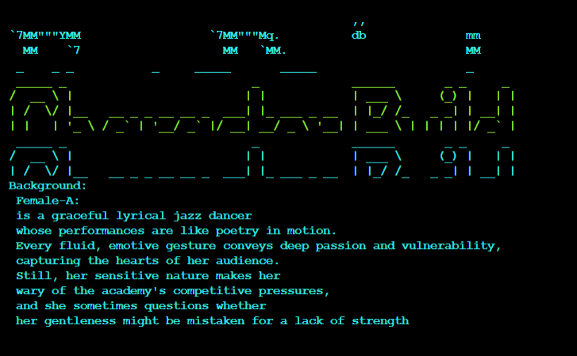

# En Pointe Dance Academy 
## Game Adventure

  

[Link to Live Site](https://en-pointe-dance-academy-game-0b6aa1afa289.herokuapp.com/)

## Introduction
Welcome to the En Pointe Dance Adventure Game! This game is an interactive experience that allows players to step into the shoes of aspiring dancers at the prestigious En Pointe Dance Academy in London. Designed using Python, the game combines storytelling, character development, and decision-making mechanics to create an engaging narrative centered around the world of dance.

The game is built with a modular structure, making use of Python classes to define character models, including attributes such as skill levels, personality traits, and background stories. Functions are used to handle game mechanics such as decision-making, scene progression, and player interactions, ensuring a flexible and scalable design. The game also follows an object-oriented approach, allowing for easy expansion by adding new characters, storylines, and challenges.

By using structured functions and reusable components, En Pointe Dance Adventure maintains clean, maintainable code, making it a great example of interactive storytelling through programming.

### Table of Content
- [En Pointe Dance Academy](#en-pointe-dance-academy)
  - [Table of Content](#table-of-content)
  - [User Stories](#user-stories)
     - [User Story 1: Character Creation](#user-story-1-character-creation)
     - [User Story 2: Decision-Based Story Progression:](#user-story-2-decision-based-story-progression)
     - [User Story 3: Dance Performance Challenges ](#user-story-3-dance-performance-challenges)
 - [Game Features](#game-features)
    - [Character Gender Selection](#character-gender-selection)
    - [Character Name Selection & Creation](#character-name-selection--creation)
    - [Character Characteristic Selection](#character-characteristic-selection)
    - [Titles](#titles)
    - [Choose Your Character's Path](#choose-your-characters-path)
    - [End of story](#end-of-story)
 - [Style and Visual Enhancements](#style-and-visual-enhancements)
 - [Syntax and Code Quality](#syntax-and-code-quality)
 - [Mapping Out the Story](#mapping-out-the-story)
 - [Technologies & Resources Used](#technologies--resources-used)
    - [Programming Languages](#programming-languages)
    -[Libraries & Modules](#libraries--modules)
    - [Educational Resources](#educational-resources)
    - [Story Writing & Development](#story-writing--development)
    - [Platforms & Tools](#platforms--tools)
- [Manual Testing](#manual-testing)
- [Bugs](#bugs)
- [Future Features](#future-features)
- [Deployment](#deployment)
   - [Cloning the Project to VSCode from GitHub](#cloning-the-project-to-vscode-from-github)
   - [Setting Up Heroku for Deployment](#setting-up-heroku-for-deployment)
   - [Steps to Deploy Using Heroku](#steps-to-deploy-using-heroku) 

  ### User Stories

  #### User Story 1: Character Creation
  As a player, I want to create my own dance student character with unique traits so that I can personalize my experience in the game.

- Acceptance Criteria
    - ✅ The player can choose a name for their character.
    - ✅ The player can select a dance style (e.g., ballet, jazz, contemporary).
    - ✅ The player can assign personality traits that affect the story.
    - ✅ The character information is stored and used in the game.

- Key Tasks
   - Create a Character class with attributes like name, dance_style, and traits.
   - Implement a function to allow the player to input and select these attributes.
   - Store the character details for use in future game decisions.
   - Display the created character’s details before starting the game.

### User Story 2: Decision-Based Story Progression:
As a player, I want to make choices that influence the story so that I can experience different outcomes.

- Acceptance Criteria
    - ✅ The player is presented with decision points throughout the game.
    - ✅ Each choice leads to different narrative paths and consequences.
    - ✅ The game stores and remembers previous choices to affect future events.
    - ✅ The player receives feedback on how their choices impact the story.

- Key Tasks
    - Create a function to present choices and capture user input.
    - Implement a StoryManager class to track choices and determine outcomes.
    - Use dictionaries or JSON to map different story branches.
    - Display the results of decisions immediately after selection.

### User Story 3: Dance Performance Challenges
As a player, I want to participate in dance performance challenges so that I can improve my character's skills and progress in the academy.

- Acceptance Criteria
    - ✅ The player is prompted to complete a dance challenge at key story moments.
    - ✅ Success or failure depends on character attributes and player choices.
    - ✅ Completing challenges rewards the player with skill points or story progression.
    - ✅ The outcome of performances affects future opportunities in the game.

- Key Tasks
    - Create a Challenge class to define different performance challenges.
    - Implement a function to determine success based on player stats and choices.
    - Provide visual or text-based feedback for performance results.
    - Store skill progression and update the character accordingly.

## Game Features 

### Character Gender Selection
At the beginning of the game, players are given the option to choose their character's gender. This selection helps personalize the player's experience at **En Pointe Dance Academy**. While gender does not affect gameplay mechanics, it adds an extra layer of immersion to the story.

Players can select from different gender options using an intuitive selection screen. Once chosen, the gender preference is stored and reflected throughout the game’s through colour, narrative and character interactions.

Below is an image of the gender selection screen:

  

### Character Name Selection & Creation

Players can personalize their journey by choosing a name for their character. They have the option to either type in a custom name or select one from a predefined list. This flexibility allows for a more immersive and tailored gameplay experience.

Once the name is chosen, it is displayed throughout the game and integrated into dialogues and interactions. This feature ensures that the player's character feels unique and fully part of the **En Pointe Dance Academy story**.

Below is an image of the character name selection screen:

   
   

### Character Characteristic Selection

Players can choose from three distinct characters, each specializing in a different dance style: Lyrical Jazz, Commercial Jazz, or Contemporary Jazz. Each character has unique strengths and personality traits that influence their journey at **En Pointe Dance Academy**.

This selection adds depth to the game, allowing players to experience different storylines and challenges based on their chosen dance style. Once selected, the character's specialty is reflected in performances, training, and interactions throughout the game.

Below is an image of the character characteristics selection screen:

   

### Titles

Each story screen in En Pointe Dance Adventure includes a title at the top, helping players keep track of where they are in the story. These titles provide context for the current scene, whether it's a assembly, a audition, or decision moment.

By displaying clear titles, players can easily follow the narrative and understand the setting of each part of their journey at **En Pointe Dance Academy**. This feature enhances immersion and ensures smooth storytelling throughout the game.

   
   

### Choose Your Character's Path
At key moments in the game, players are presented with three choices that determine their character's journey. Each option leads to a different path, shaping the story, challenges, and opportunities the character will encounter at En Pointe Dance Academy.

These decisions allow for multiple playthroughs, as each choice unlocks unique experiences and outcomes. Players must think carefully about their selections, as their choices influence friendships, rivalries, and career progression in the dance world.

Below is an image of the path selection screen:

  

### End of story
To ensure a smooth and satisfying conclusion, En Pointe Dance Adventure provides a clear visual indication when the story has ended. This helps players recognize that they have reached the final outcome of their character's journey at En Pointe Dance Academy.

  

## Style and Visual Enhancements

To create a visually engaging experience, En Pointe Dance Adventure incorporates a mix of typography, color, and symbols to enhance storytelling and readability.

- Adobe Font – **Am-udine**: This unique font is used for h1 headings, chosen for its elegant curves that reflect the artistry and movement of dance. It adds a distinctive and stylish touch to the game’s interface.
- Emoji Decorations 🎭✨: Emojis are used throughout the game to add personality, enhance storytelling, and reflect a character’s mood or emotions in key moments.
- Colored Text with **termcolor** 🎨: A custom function, print_colour(), was created to highlight important text. Different colors are used to emphasize dialogue, emotions, or significant events, making the text stand out and enhancing readability.
Fancy Titles with pyfiglet 🏆: To give the game a polished and theatrical feel, pyfiglet is used to generate stylized ASCII text for scene titles and important game moments. This adds a dramatic effect that aligns with the stage-like experience of a dance academy.
These styling choices help bring the world of En Pointe Dance Adventure to life, making it both visually appealing and easy to navigate.

## Syntax and Code Quality
To ensure clean and efficient code, En Pointe Dance Adventure follows best practices in syntax and formatting. A linter was used throughout development to catch errors, enforce consistency, and improve readability.

Linters help identify potential issues such as missing imports, incorrect indentation, and unused variables, making the code more maintainable and professional. By following these guidelines, the game remains structured, error-free, and easy to expand in future updates.

Below is an image of the linter in action:

  

## Mapping Out the Story
To create a well-structured and immersive narrative, the storyline of En Pointe Dance Adventure was carefully mapped out before development. This process involved planning key events, decision points, and multiple branching paths to ensure a dynamic and engaging player experience.

By visually outlining the story, it became easier to track character progressions, ensure logical flow, and maintain consistency across different choices. This structured approach allows for seamless storytelling while keeping the game flexible for future expansions.

Below is an image of the story map:

  

## Technologies & Resources Used

### Programming Languages
 - **Python** – Used for the entire codebase, along with online educational resources to enhance learning.

### Libraries & Modules

The game utilizes several Python libraries and modules to enhance functionality and aesthetics:

- **colorama** – Used for adding color to console output.
- **json** – Handles data storage for player choices and game states.
- **emoji** – Adds emoji decorations to enhance storytelling and express character emotions.
- **os & time** – Used for system operations and timed delays to improve game flow.
- **termcolor** (with colored and cprint) – Allows for color-coded text to emphasize emotions and dialogue.
- **pyfiglet (with Figlet)** – Generates fancy ASCII art titles for dramatic effect.

### Educational Resources

**YouTube** 🎥 – To understand how to use classes for an adventure game. [Python: classes & objects text adventure](https://www.youtube.com/watch?v=xWzUHRIgYCc)

### Story Writing & Development

**ChatGPT** (Me! 🤖) – Assisted with brainstorming, structuring story paths, character development, and refining narrative choices to ensure an immersive and engaging experience.

### Platforms & Tools
- **GitHub** – Used for storing code remotely and version control.
- **VSCode** – Integrated Development Environment (IDE) for writing and testing the project. My favorite IDE 😊
- **Copilot** – AI-powered assistance for code optimization, cleanliness, and efficiency. Now included with **VSCode**
**Heroku** – Used to deploy and render the project since GitHub only supports static files, while Heroku can host Python-based applications..

## Manual Testing

To ensure a smooth and bug-free experience, every input and possible outcome for each character was manually tested. This included verifying that:

- All player inputs (character name, gender, dance style, and choices) are correctly processed.
- Each decision leads to the appropriate storyline branch and does not break the game flow.
- Character-specific paths (Lyrical Jazz, Commercial Jazz, Contemporary Jazz) trigger the correct challenges and events.
- The text formatting, colors, emojis, and ASCII titles display correctly across different screens.
- The game properly saves and recalls player choices where necessary.

By rigorously testing all possible routes, inconsistencies and errors were identified and fixed, ensuring a fully functional and immersive gameplay experience.

## Bugs

1.  Inconsistent Terminal Clearing with next_clear Function **(unfixed)**
During development, a custom function **next_clear** was created using the **time** and **os modules** to introduce a pause and then clear the terminal. The goal was to create a smooth transition between different scenes in the game.

However, an issue arose where the terminal would not always clear as expected. To try and fix this, the next_clear function was nested within every function to ensure it executed at the right moments. Despite this, the behavior remained inconsistent, sometimes clearing the screen properly and other times failing to do so.

The bug was difficult to pinpoint as it seemed to be affected by factors such as:

Differences in how the os.system("cls" or "clear") command executes on various platforms.
Potential interference from other print statements or user inputs.
This remains an area for further debugging and optimization to ensure consistent screen transitions across all systems.

Below is an image showing the issue in testing:

  

2.   `player_score` Rendering as Empty **(fixed)**
Another issue encountered during development was the player_score variable appearing empty, even though it had a valid value assigned. This caused confusion, as the score was supposed to track progress and performance in dance challenges.

Debugging Attempts & Observations
Verified that the variable was correctly updated after each challenge.
Printed player_score at different points in the game to check its value.
Checked if the variable was accidentally being overwritten or reset.
Ensured the scope of player_score was accessible where needed.

`player_score` rendering as empty was resolved by identifying two key problems:

1.  Incorrect Indentation – The variable update had unintentionally become part of an elif statement, meaning it only executed under specific conditions instead of updating consistently. Fixing the indentation ensured that player_score was correctly modified regardless of the path taken in the game.

2. Scope Issues – Some functions couldn’t access `player_score` because it wasn’t explicitly declared as a global variable. By adding **global player_score** at the top of relevant functions, the variable became accessible across the entire program, ensuring it retained its value throughout gameplay.

## Future Features
Looking ahead, there are several exciting ways to expand En Pointe Dance Adventure, making the experience even richer and more immersive for players. Planned future features include:

- More Playable Characters – Expanding the selection of characters by creating a Character Class, allowing for new personalities, backstories, and unique dance styles to be introduced.
- Expanded Academy Storyline – Adding more in-depth storytelling during the students' time at the academy, with additional opportunities for the player to make decisions that shape their journey.
- Post-Academy Career Paths – Exploring what happens after graduation, following the characters as they navigate their first professional dance jobs, dealing with new challenges and opportunities in the industry.
- Teacher Selection – Allowing players to choose their dance teachers based on personality, teaching style, and specializations, impacting how they develop skills and handle training.
- Skill Progression System – Implementing a leveling system where characters improve their skills over time, unlocking advanced dance moves and gaining reputation based on their performances.
- Dynamic Relationships – Introducing friendships and rivalries, where interactions with other students and teachers shape the story and create unique conflicts or alliances.
- Dance Competitions & Auditions – Expanding gameplay with competitive events, where the player's choices and skill level determine their success in high-stakes performances.

## Deployment

### Cloning the Project to VSCode from GitHub
  - Anyone can clone and download En Pointe Dance adventure.
  **Requirements are:**
    - A Email Account
    - A free GitHub account

1. **Log in to your GitHub account** - navigate to [https://github.com/SamAtkinsonModeste/En-Pointe-Dance-Academy-Game](https://github.com/SamAtkinsonModeste/En-Pointe-Dance-Academy-Game).
2. **Click on the Green Code Button** – This will show a dropdown with different cloning options of copy or clone it, or fork the repository.
3. **Copy the Repository Link** – Click the copy icon next to the HTTPS link.
4. **Open VS Code** – Launch VS Code on your computer.
5. **Open the Command Palette** – `Click View > Command Palette`, then search for Git: Clone and select it.
6. **Paste the Repository Link** – In the pop-up, paste the GitHub link you copied earlier.
7. **Choose a Local Folder** – Select a location on your computer where you want to store the project.
8. **Wait for the Clone to Complete** – VS Code will download the repository, and you should see the project files appear in the file explorer.
9. **Open the Project Folder** – Once cloning is complete, click Open Folder to start working on your project.

### Setting Up Heroku for Deployment

Since GitHub only hosts static files (such as HTML, CSS, and JavaScript), Heroku is used to deploy the project because it can handle dynamic Python applications like this game. Heroku provides a platform for hosting web applications and automatically updating deployments from GitHub.

#### Steps to Deploy Using Heroku
1. Create a Heroku Account – Go to [Heroku](https://www.heroku.com/) and sign up for a free account if you don’t already have one.
2. Log in to Heroku – Once your account is created, log in to the Heroku Dashboard.
3. Create a New App
  - Click the New button and select Create New App.
  - Enter a unique name for your project.
  - Choose your region (e.g., United States or Europe).
  - Click Create App.
4. Go to the Deployment Tab – In the app dashboard, navigate to the Deployment section.
5. Connect to GitHub
   - Under Deployment method, select GitHub.
   - Click Connect to GitHub and authorize Heroku to access your repositories.
  - Search for your project repository and click Connect.
6. Enable Automatic Deployment
  - Scroll down to Automatic Deploys.
  - Click Enable Automatic Deploys to allow Heroku to update your app whenever changes are pushed to GitHub.
7. Manually Deploy (Optional) – If you want to deploy immediately, click Deploy Branch under Manual Deploy.
Wait for the Deployment to Finish – Once the deployment completes, Heroku will provide a live URL where your project is hosted.

