# En Pointe Dance Academy 
## Game Adventure

  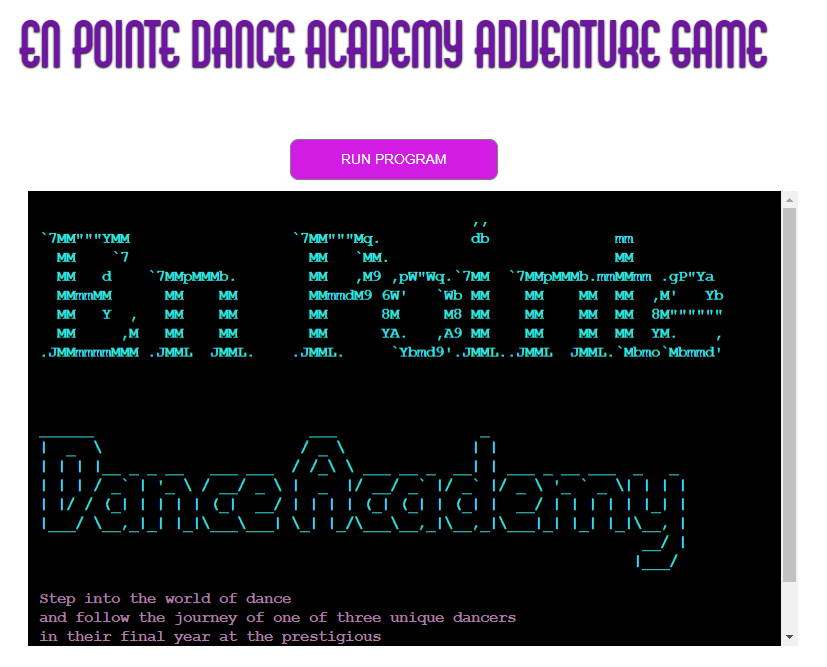

[Link to Live Site](https://en-pointe-dance-academy-game-0b6aa1afa289.herokuapp.com/)

## Introduction
Welcome to the En Pointe Dance Adventure Game! This game is an interactive experience that allows players to step into the shoes of aspiring dancers at the prestigious En Pointe Dance Academy in London. Designed using Python, the game combines storytelling, character development, and decision-making mechanics to create an engaging narrative centered around the world of dance.

The game is built with a modular structure, making use of Python classes to define character models, including attributes such as skill levels, personality traits, and background stories. Functions are used to handle game mechanics such as decision-making, scene progression, and player interactions, ensuring a flexible and scalable design. The game also follows an object-oriented approach, allowing for easy expansion by adding new characters, storylines, and challenges.

By using structured functions and reusable components, En Pointe Dance Adventure maintains clean, maintainable code, making it a great example of interactive storytelling through programming.

### Table of Content
- [En Pointe Dance Academy](#en-pointe-dance-academy)
  - [Table of Content](#table-of-content)
  - [User Stories](#user-stories)
     - [User Story 1: Character Creation](#user-story-1-character-creation)
     - [User Story 2: Decision-Based Story Progression:](#user-story-2-decision-based-story-progression)
     - [User Story 3: Dance Performance Challenges ](#user-story-3-dance-performance-challenges)
 - [Game Features](#game-features)
    - [Character Gender Selection](#character-gender-selection)
    - [Character Name Selection & Creation](#character-name-selection--creation)
    - [Character Characteristic Selection](#character-characteristic-selection)
    - [Titles](#titles)
    - [Choose Your Character's Path](#choose-your-characters-path)
    - [End of story](#end-of-story)

  ### User Stories

  #### User Story 1: Character Creation
  As a player, I want to create my own dance student character with unique traits so that I can personalize my experience in the game.

- Acceptance Criteria
    - ✅ The player can choose a name for their character.
    - ✅ The player can select a dance style (e.g., ballet, jazz, contemporary).
    - ✅ The player can assign personality traits that affect the story.
    - ✅ The character information is stored and used in the game.

- Key Tasks
   - Create a Character class with attributes like name, dance_style, and traits.
   - Implement a function to allow the player to input and select these attributes.
   - Store the character details for use in future game decisions.
   - Display the created character’s details before starting the game.

### User Story 2: Decision-Based Story Progression:
As a player, I want to make choices that influence the story so that I can experience different outcomes.

- Acceptance Criteria
    - ✅ The player is presented with decision points throughout the game.
    - ✅ Each choice leads to different narrative paths and consequences.
    - ✅ The game stores and remembers previous choices to affect future events.
    - ✅ The player receives feedback on how their choices impact the story.

- Key Tasks
    - Create a function to present choices and capture user input.
    - Implement a StoryManager class to track choices and determine outcomes.
    - Use dictionaries or JSON to map different story branches.
    - Display the results of decisions immediately after selection.

### User Story 3: Dance Performance Challenges
As a player, I want to participate in dance performance challenges so that I can improve my character's skills and progress in the academy.

- Acceptance Criteria
    - ✅ The player is prompted to complete a dance challenge at key story moments.
    - ✅ Success or failure depends on character attributes and player choices.
    - ✅ Completing challenges rewards the player with skill points or story progression.
    - ✅ The outcome of performances affects future opportunities in the game.

- Key Tasks
    - Create a Challenge class to define different performance challenges.
    - Implement a function to determine success based on player stats and choices.
    - Provide visual or text-based feedback for performance results.
    - Store skill progression and update the character accordingly.

## Game Features 

### Character Gender Selection
At the beginning of the game, players are given the option to choose their character's gender. This selection helps personalize the player's experience at **En Pointe Dance Academy**. While gender does not affect gameplay mechanics, it adds an extra layer of immersion to the story.

Players can select from different gender options using an intuitive selection screen. Once chosen, the gender preference is stored and reflected throughout the game’s through colour, narrative and character interactions.

Below is an image of the gender selection screen:

  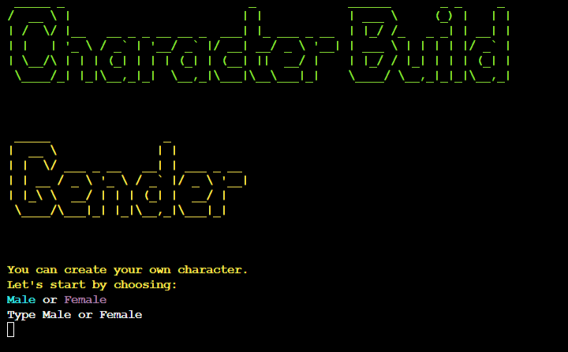

### Character Name Selection & Creation

Players can personalize their journey by choosing a name for their character. They have the option to either type in a custom name or select one from a predefined list. This flexibility allows for a more immersive and tailored gameplay experience.

Once the name is chosen, it is displayed throughout the game and integrated into dialogues and interactions. This feature ensures that the player's character feels unique and fully part of the **En Pointe Dance Academy story**.

Below is an image of the character name selection screen:

  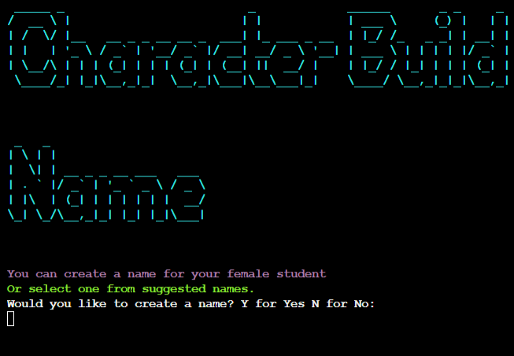 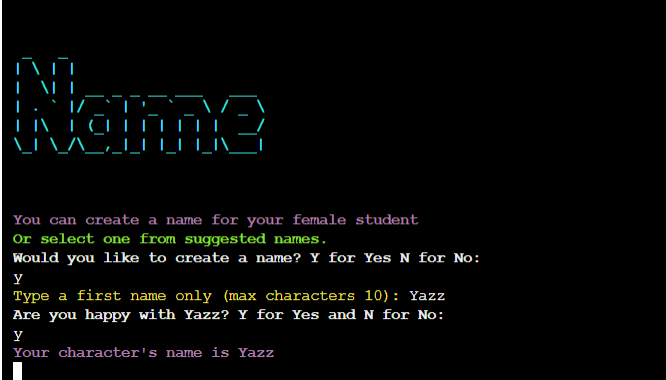
   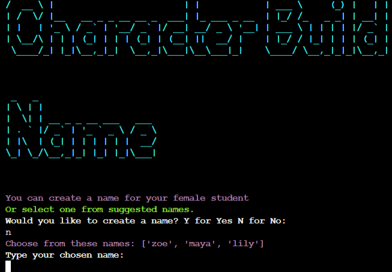

### Character Characteristic Selection

Players can choose from three distinct characters, each specializing in a different dance style: Lyrical Jazz, Commercial Jazz, or Contemporary Jazz. Each character has unique strengths and personality traits that influence their journey at **En Pointe Dance Academy**.

This selection adds depth to the game, allowing players to experience different storylines and challenges based on their chosen dance style. Once selected, the character's specialty is reflected in performances, training, and interactions throughout the game.

Below is an image of the character characteristics selection screen:

  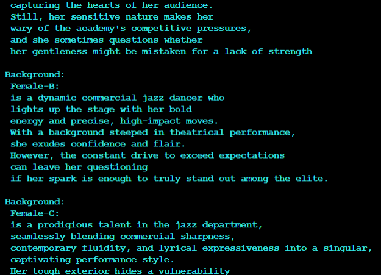 

### Titles

Each story screen in En Pointe Dance Adventure includes a title at the top, helping players keep track of where they are in the story. These titles provide context for the current scene, whether it's a assembly, a audition, or decision moment.

By displaying clear titles, players can easily follow the narrative and understand the setting of each part of their journey at **En Pointe Dance Academy**. This feature enhances immersion and ensures smooth storytelling throughout the game.

  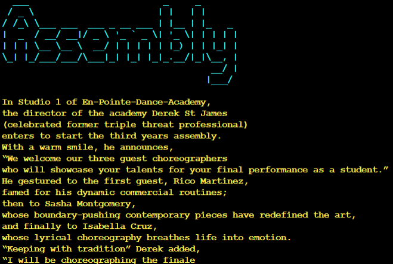 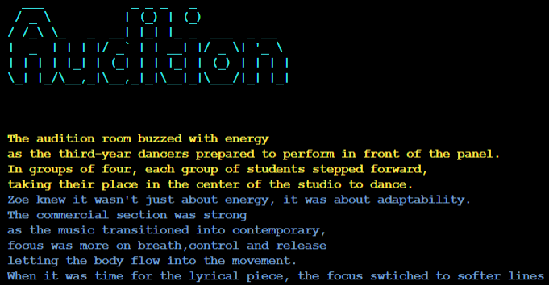
   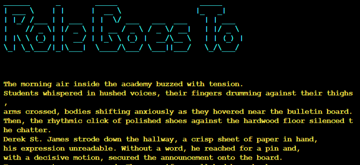

### Choose Your Character's Path
At key moments in the game, players are presented with three choices that determine their character's journey. Each option leads to a different path, shaping the story, challenges, and opportunities the character will encounter at En Pointe Dance Academy.

These decisions allow for multiple playthroughs, as each choice unlocks unique experiences and outcomes. Players must think carefully about their selections, as their choices influence friendships, rivalries, and career progression in the dance world.

Below is an image of the path selection screen:

  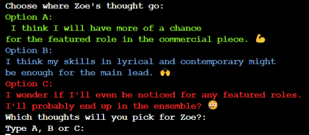

### End of story
To ensure a smooth and satisfying conclusion, En Pointe Dance Adventure provides a clear visual indication when the story has ended. This helps players recognize that they have reached the final outcome of their character's journey at En Pointe Dance Academy.

  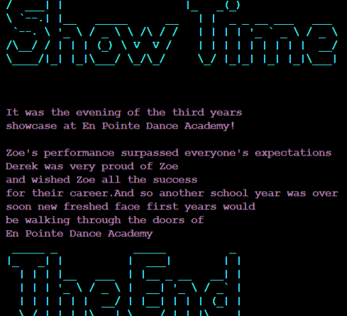

